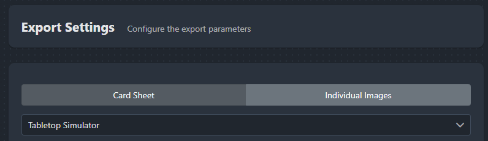
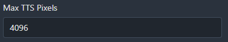
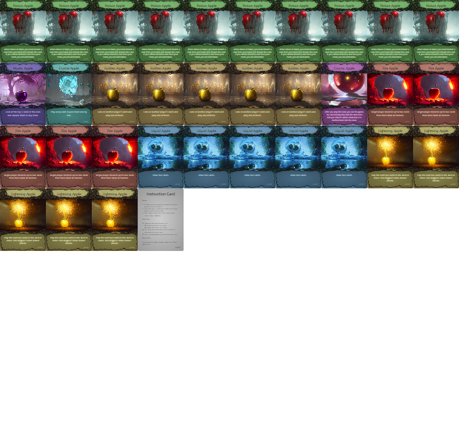
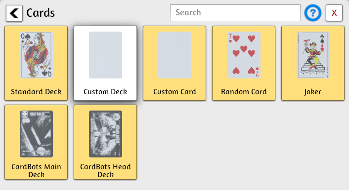
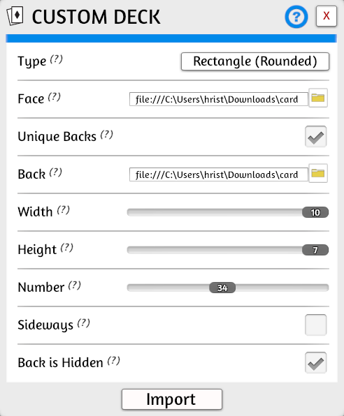
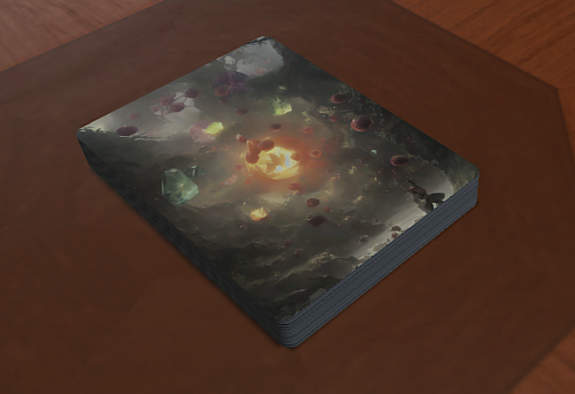

# Tabletop Simulator (TTS) Export

## 4.1 Export from Cider

To prepare your cards for Tabletop Simulator, go to `File` > `Export Cards`. With **Card Sheet** selected, also select `Tabletop Simulator` in the dropdown.

Selecting the TTS option automatically adjusts critical settings:
*   **Card Margins** and **Paper Margins** are set to 0.
*   The system calculates optimal sheet sizes to fit a maximum number of cards, typically aiming for the TTS standard of 69 cards per sheet (a 10x7 grid, with 1 blank space).
*   It disables the back-side preview, as TTS imports backs separately.

### Max TTS Pixels Setting

By default TTS recommends sheet images no larger than `4096 x 4096` pixels ([Tabletop Simulator max pixels][tts-max-pixels-url]). However, on some systems, large images might still be supported. The **Max TTS Pixels** setting in Cider lets you override the 4096 max pixel limit and set it to a larger value (or lower for performance testing). This value directly controls the scaling (`pixelRatio`) used when rendering the sheet image.

Exported Image

## 4.2 Import into Tabletop Simulator

Start up Tabletop Simulator and go to `Objects` > `Components` > `Cards` > `Custom Deck`.

Use the below settings to import your card sheets. Make sure to select your `sheet-front-*` image in `Face` and your `sheet-back-*` image in `Back`. If your export included more than 69 cards, then you will have to create several custom decks. Once created you can combine the cards into a single deck.

Make sure to set the `Number` of cards in the sheet.

Congratulations you have imported your cards into TTS.

[tts-max-pixels-url]: https://kb.tabletopsimulator.com/custom-content/asset-creation/