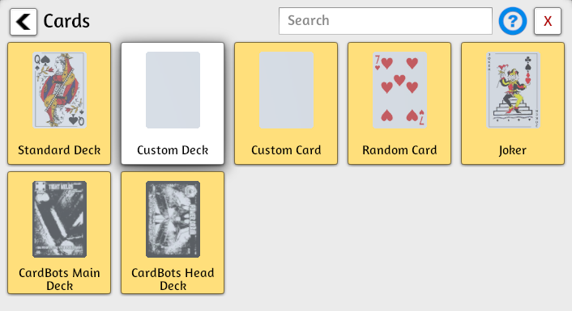
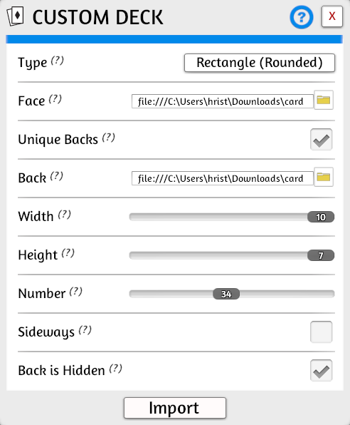
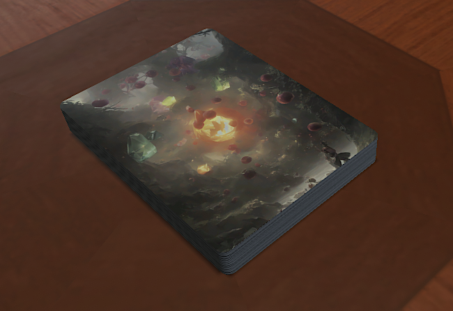

# Tabletop Simulator (TTS) Export

## 4.1 Export from Cider
Go to `File` > `Export Cards`. With Card Sheet selected, also select `Tabletop Simulator` in the dropdown.

By default TTS recommends sheet images no larger than `4096 x 4096` pixels ([Tabletop Simulator max pixels][tts-max-pixels-url]). However on some systems, people have been able to import sheets with larger dimensions. The Max TTS Pixels setting in Cider lets you override the 4096 max pixel setting and set it to a larger setting that works for you.

Exported Image

## 4.2 Import into Tabletop Simulator

Start up Tabletop Simulator and go to `Objects` > `Components` > `Cards` > `Custom Deck`.

Use the below settings to import your card sheets. Make sure to select your `sheet-front-*` image in `Face` and your `sheet-back-*` image in `Back`. If your export included more than 69 cards, then you will have to create several custom decks. Once created you can combine the cards into a single deck.

Make sure to set the `Number` of cards in the sheet.

Congratulations you have imported your cards into TTS.

[tts-max-pixels-url]: https://kb.tabletopsimulator.com/custom-content/asset-creation/
